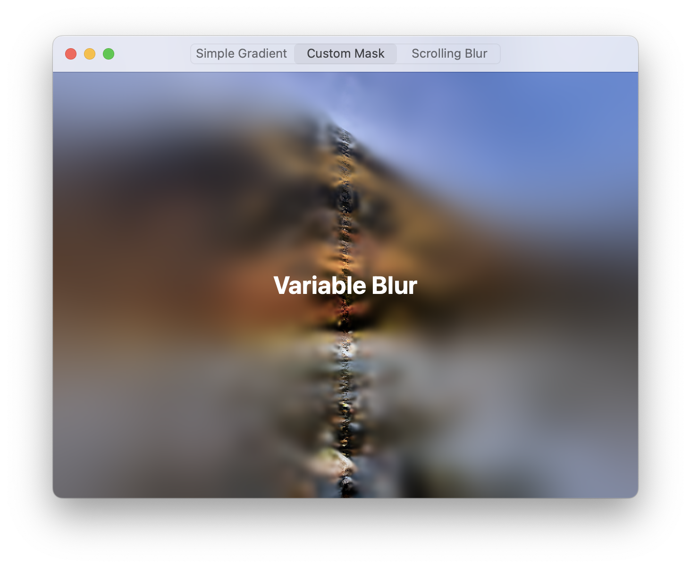
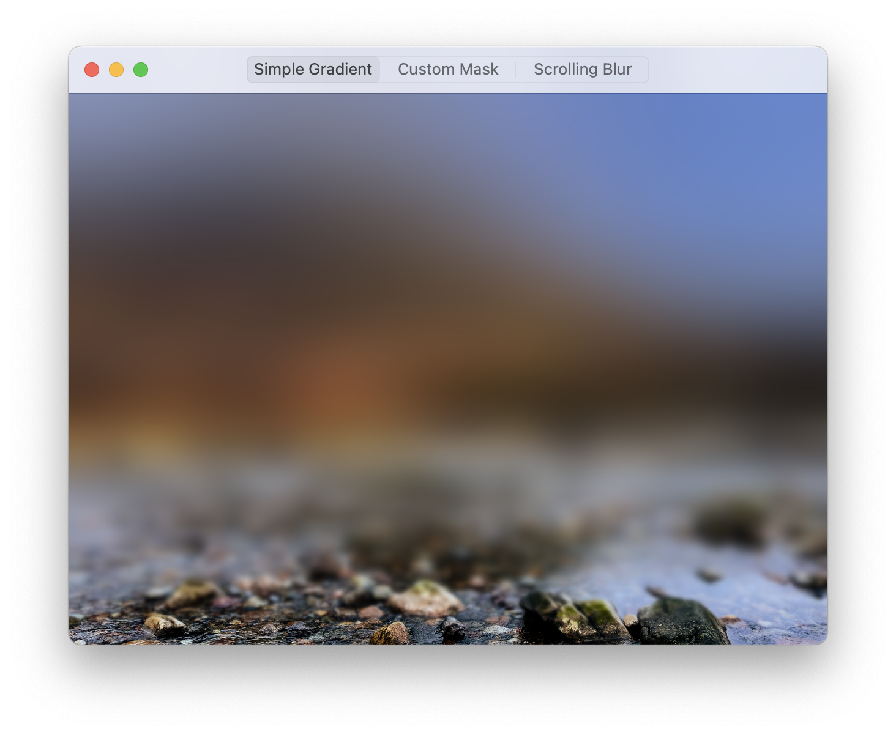
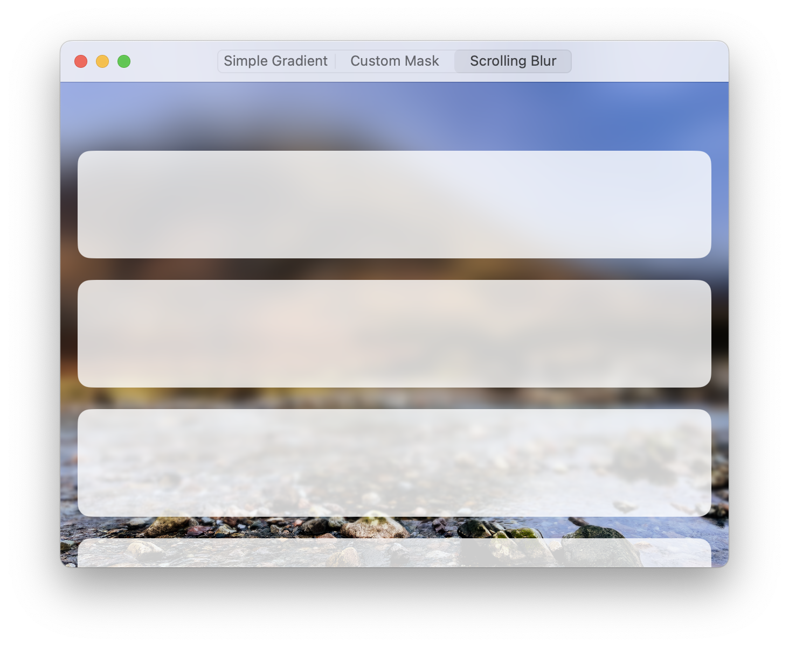

# VariableBlur

A SwiftUI component for applying variable blur effects across iOS, macOS, visionOS, and tvOS.


## 🐉 SPI Usage

This package uses Apple's private `CAFilter` API to create advanced blur effects. While this enables powerful functionality at incredibly low overhead, please be aware:

- Apple may reject apps using private APIs during review
- SPI may change without notice in future OS versions
- Consider this experimental and use with care in production environments

## Overview

`VariableBlur` enables beautiful, custom blur effects that gradually vary in intensity across a view. It provides a cross-platform implementation supporting iOS, macOS, visionOS, and tvOS using the same consistent API.



## Features

- Cross-platform: Works on iOS, macOS, tvOS, and visionOS
- Multiple mask types: Use gradients, images, or custom SwiftUI views
- Customizable and animatable blur radius
- Simple declarative API that integrates seamlessly with SwiftUI codebases

## Installation

### Swift Package Manager

Add VariableBlur to your Swift package dependencies:

```swift
dependencies: [
    .package(url: "https://github.com/philptr/VariableBlur.git", .upToNextMajor(from: "1.0.0")),
]
```

And add it to your target:

```swift
targets: [
    .target(
        name: "YourApp",
        dependencies: ["VariableBlur"]
    )
]
```

## Platform Support

```swift
platforms: [
    .iOS(.v16),
    .macOS(.v13),
    .tvOS(.v16),
    .visionOS(.v1)
]
```

## Usage Examples

### Basic Gradient Blur

```swift
import SwiftUI
import VariableBlur

struct GradientBlurExample: View {
    var body: some View {
        ZStack {
            Image("scenery")
                .resizable()
                .aspectRatio(contentMode: .fill)
                .edgesIgnoringSafeArea(.all)
            
            // Apply variable blur with a smooth gradient.
            VariableBlur(
                blurRadius: 30,
                from: .bottom,
                to: .top
            )
        }
    }
}
```



### SwiftUI View as the Mask

```swift
VariableBlur(blurRadius: 25) {
    // This SwiftUI view becomes the mask.
    LinearGradient(
        colors: [.black, .clear, .black],
        startPoint: .leading,
        endPoint: .trailing
    )
}
```

### Image Mask

```swift
struct ImageMaskExample: View {
    let maskImage: CGImage
    
    var body: some View {
        // ...
        VariableBlur(blurRadius: 40, mask: maskImage)
    }
}
```

### Advanced Use Cases

`VariableBlur` supports changing the parameters of the blur at runtime, including the ability to animate and / or transition them between two or more states. For example, you may change the radius of the blur interactively as the user scrolls your view. See the sample project for an complete use case.



## Credits

This package was inspired by and builds upon [VariableBlurView](https://github.com/jtrivedi/VariableBlurView) by Janum Trivedi, which implemented this approach for iOS. This implementation extends the functionality to be cross-platform and introduces additional customization options for extra flexibility in real-world projects.
